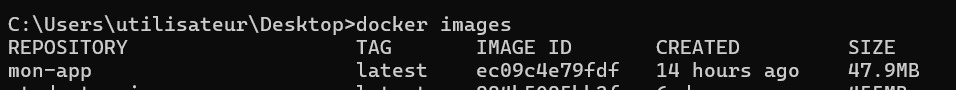

### Déploiement Automatisé d'une Application Web avec CI/CD sur Jenkins et AWS ###

## Introduction ##
Ce projet met en place une pipeline CI/CD avec Jenkins pour construire, tester, publier et déployer une application web en utilisant Docker et AWS.

## Structure du projet ##
```
APP
├──  Dockerfile   
├──  index.html   
├──  Jenkinsfile 
```
## Étape 1: Configuration de Docker ##
1. Créer un fichier Dockerfile :


2. Construire et tester l’image Docker :


3. test :




4. Pousser l’image sur Docker Hub :
   


## Étape 2: Configuration du pipeline Jenkins ##

2. Créer un pipeline dans Jenkins :


